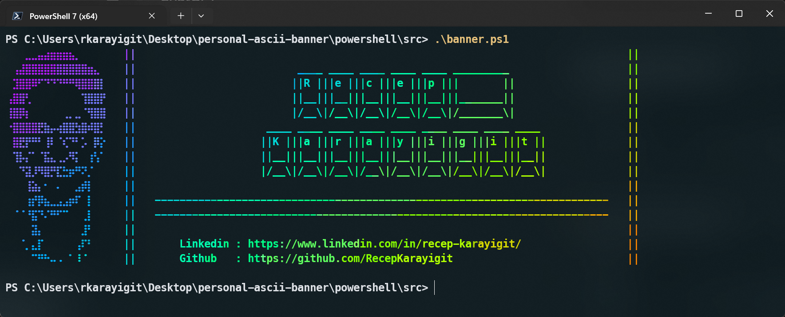

# 🎉 Terminal Banner Collection

This repository is a collection of **customizable terminal banners** for Windows Command Prompt (**Batch**) and PowerShell.  
Each subproject provides a different way to create and display personalized banners for your terminal sessions — from simple static UTF-8 banners to dynamic, colorful ASCII art.

---

## 📦 Included Projects

### 1️⃣ **Banner Batch Script**
A lightweight **Windows Batch** script that displays a banner from a UTF-8 text file and restores the terminal to its original state afterward.

- ✅ Uses `banner.txt` as the banner source  
- ✅ Preserves original **code page** and **console colors**  
- ✅ Simple, portable, and requires no external dependencies  
- ✅ Ideal for lightweight banners in **Command Prompt**  

📍 See [banner-batch](./banner-batch/README.md) for details.

---

### 2️⃣ **Personal ASCII Banner (PowerShell + Figlet + lolcat)**
A **PowerShell script** that generates dynamic ASCII banners using **Figlet** and colors them with **lolcat**.  
Perfect for personal branding, CLI customization, or making your PowerShell prompt unique.

- ✅ Supports custom **logos, usernames, and dividers**  
- ✅ Multiple **ASCII fonts** available via Figlet  
- ✅ **Colored output** via lolcat  
- ✅ Optionally auto-load banner at PowerShell startup  

📍 See [banner-ps](./banner-ps/README.md) for details.

---

## 🚀 Quick Start

Clone the repository:

```bash
git clone https://github.com/RecepKarayigit/personal-ascii-banner.git
cd personal-ascii-banner
```

### ▶️ Run Batch Banner
```bat
cd banner-batch
banner.bat
```

### ▶️ Run PowerShell Banner
```powershell
cd banner-ps
pwsh ./banner.ps1
```

---

## 📸 Examples

- **Batch Script Banner (green text):**  
  

- **PowerShell ASCII Banner (Figlet + lolcat):**  
  

---

## 🔧 Requirements

### For Batch Script
- Windows 10/11  
- `banner.txt` saved in UTF-8  

### For PowerShell Script
- [PowerShell 7+](https://learn.microsoft.com/powershell/)  
- [Figlet](http://www.figlet.org/)  
- [lolcat](https://github.com/busyloop/lolcat)  

---

## 🧑‍💻 Author

**Recep Karayigit**

- 🌐 [LinkedIn](https://www.linkedin.com/in/recep-karayigit/)  
- 💻 [GitHub](https://github.com/RecepKarayigit)  

---

## 📜 License
This project is licensed under the **MIT License**.  
