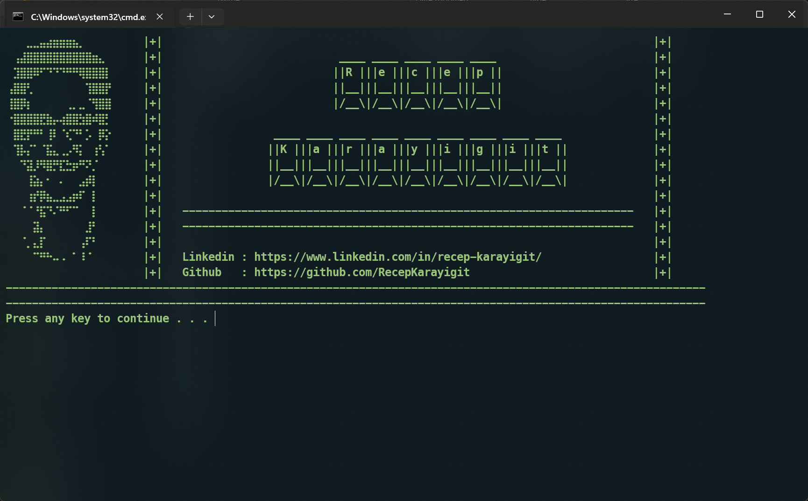

# Banner Batch Script

This batch script displays a UTF-8 banner in **green text**, then restores the console back to the user’s original settings.

---

## Features

* Automatically saves and restores the **original code page** (so you can use UTF-8 for the banner without breaking other scripts).
* Saves and restores the **original console color**.
* Prints banner from a text file (`banner.txt`).
* Ensures the console looks the same after the script ends as it did before.

---

## Requirements

* Windows 10/11 with support for `chcp 65001` (UTF-8).
* `banner.txt` saved with **UTF-8 encoding**.

---

## Usage

1. Create your banner text file:

   * Name it `banner.txt`.
   * Save it as **UTF-8** (without BOM).
   * Place it in the same folder as the batch file.

2. Run the batch file:

   ```bat
   banner.bat
   ```

3. The banner will be displayed in **dark green (color 02)**, then the console will return to its **previous colors and code page**.

---

Example result:
---------------
### Sample Screenshot : 



## Customization

* **Change banner color:**

  * Modify the line:

    ```bat
    color 02
    ```
  * Replace `02` with another color code. Example:

    * `0A` = Bright Green
    * `0C` = Bright Red
    * `0E` = Yellow

* **Change banner file:**

  * Replace `banner.txt` with any other UTF-8 text file.

---

## Notes

* If you run this inside Windows Terminal or a custom console host, colors may look slightly different depending on the theme.
* The script restores both **code page** and **colors** at the end, so it won’t mess up your console session.
